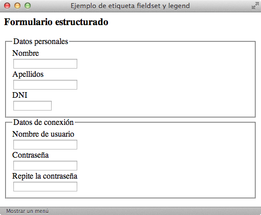

# Formularios avanzados

Utilizando solamente las etiquetas `<form>` y `<input>` es posible diseñar la mayoría de formularios de las aplicaciones web. No obstante, HTML define algunos elementos adicionales para mejorar la estructura de los formularios creados.

La etiqueta `<fieldset>` agrupa campos del formulario y la etiqueta `<legend>` asigna un nombre a cada grupo.

| Etiqueta              | `<fieldset>`    |
| --------------------: | :------------- |
| **Atributos comunes** | básicos, internacionalización, eventos |
| **Atributos propios** | - |
| **Tipo de elemento**  | En bloque |
| **Descripción**       | Se emplea para agrupar de forma lógica varios campos de un formulario |

| Etiqueta              | `<leyend>`    |
| --------------------: | :------------- |
| **Atributos comunes** | básicos, internacionalización, eventos |
| **Atributos propios** | - |
| **Tipo de elemento**  | En línea |
| **Descripción**       | Se emplea para definir el título o leyenda de un conjunto de campos de formulario agrupados con la etiqueta fieldset |

Un ejemplo de **código HTML** con las etiquetas `<fieldset>` y `<legend>` sería:

```html
<form action="maneja_formulario.php" method="post">
  <fieldset>
    <legend>Datos personales</legend>
    Nombre <br/>
    <input type="text" name="nombre" value="" />
    <br/>
    Apellidos <br/>
    <input type="text" name="apellidos" value="" />
    <br/>
    DNI <br/>
    <input type="text" name="dni" value="" size="10" maxlength="9" />
  </fieldset>
  <fieldset>
    <legend>Datos de conexión</legend>
    Nombre de usuario<br/>
    <input type="text" name="nombre" value="" maxlength="10" />
    <br/>
    Contraseña<br/>
    <input type="password" name="password" value="" maxlength="10" />
    <br/>
    Repite la contraseña<br/>
    <input type="password" name="password2" value="" maxlength="10" />
  </fieldset>
</form>```

Y un navegador lo visualizaría de esta manera:



La etiqueta `<fieldset>` agrupa todos los controles de formulario a los que encierra. El navegador muestra por defecto un borde resaltado para cada agrupación. La etiqueta `<legend>` se incluye dentro de cada etiqueta `<fieldset>` y establece el título que muestra el navegador para cada agrupación de elementos.

Por otra parte, todos los controles de formulario salvo los botones presentan una carencia muy importante: no disponen de la opción de establecer el título o texto que se muestra junto al control. En el código HTML del ejemplo anterior, el nombre de cada campo se incluye en forma de texto normal, sin ninguna relación con el campo al que hace referencia.

Afortunadamente, el lenguaje HTML incluye una etiqueta denominada `<label>` y que se utiliza para establecer el título de cada campo del formulario. Su definición formal es la siguiente:

| Etiqueta              | `<label>`    |
| --------------------: | :------------- |
| **Atributos comunes** | básicos, internacionalización, eventos |
| **Atributos propios** | `for="id"` Indica el ID del campo del formulario para el que este elemento es su título<br />Otros: `accesskey`, `onfocus` y `onblur` |
| **Tipo de elemento**  | En línea |
| **Descripción**       | Se emplea para definir el título o leyenda de los campos definidos en un formulario |

El único atributo que suele utilizarse con la etiqueta `<label>` es `for`, que indica el identificador (atributo id) del campo de formulario para el que esta etiqueta hace de título.

En el anterior ejemplo, el nombre de los campos de formulario se incluía mediante un texto normal:

```html
Nombre <br/>
<input type="text" name="nombre" value="" />
Apellidos <br/>
<input type="text" name="apellidos" value="" />
DNI <br/>
<input type="text" name="dni" value="" size="10" maxlength="9" />```


Utilizando la etiqueta `<label>`, cada campo de formulario puede disponer de su propio título:

```html
<label for="nombre">Nombre</label> <br/>
<input type="text" id="nombre" name="nombre" value="" />
<label for="apellidos">Apellidos</label> <br/>
<input type="text" id="apellidos" name="apellidos" value="" />
<label for="dni">DNI</label> <br/>
<input type="text" id="dni" name="dni" value="" size="10" maxlength="9" />```

La principal ventaja de utilizar `<label>` es que el código HTML está mejor estructurado y se mejora su accesibilidad. Además, al pinchar sobre el texto del `<label>`, el puntero del ratón se posiciona automáticamente para poder escribir sobre el campo de formulario asociado. Este comportamiento es especialmente útil para los campos de tipo radiobutton y checkbox.
