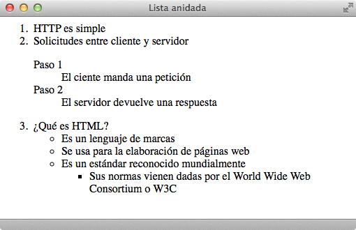

# Listas anidadas

Como ya hemos mencionado, podemos anidar varias listas a otras y crear así listas compuestas a nuestro gusto.

Un ejemplo de **código HTML** de una lista anidada sería:

```html
<html>
    <head>
        <title>Lista anidada</title>
    </head>
    <body>
        <ol>
            <li>HTTP es simple</li>
            <li>Solicitudes entre cliente y servidor
                <dl>
                    <dt>Paso 1</dt>
                        <dd>El ciente manda una petición</dd>
                   <dt>Paso 2</dt>
                        <dd>El servidor devuelve una respuesta</dd>
                </dl>
            </li>
            <li>¿Qué es HTML?
                <ul>
                    <li>Es un lenguaje de marcas</li>
                    <li>Se usa para la elaboración de páginas web</li>
                    <li>Es un estándar reconocido mundialmente
                        <ul>
                            <li>Sus normas vienen dadas por el
                            World Wide Web Consortium o W3C</li>
                        </ul>
                    </li>
                </ul>
            </li>
         </ol>
    </body>
</html>```


Que un navegador visualizaría de esta manera:



<div class="exercise">
  <p class="title">Ejercicio 8</p>
</div>

[Ver enunciado](#ej08)

<div class="exercise">
  <p class="title">Ejercicio 9</p>
</div>

[Ver enunciado](#ej09)
