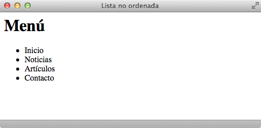

# Listas no ordenadas

Estas listas son las más utilizadas. Se componen de elementos relacionados entre sí pero para los que no se indica un orden. Las **listas no ordenadas** van dentro de las etiquetas `<ul>`…`</ul>` y cada punto que queramos añadir dentro de las etiquetas `<li>`…`</li>`.

| Etiqueta              | `<ul>`    |
| --------------------: | :------------- |
| **Atributos comunes** | básicos, internacionalización, eventos |
| **Atributos propios** | - |
| **Tipo de elemento**  | En bloque |
| **Descripción**       | Se emplea para definir listas no ordenadas |

| Etiqueta              | `<li>`    |
| --------------------: | :------------- |
| **Atributos comunes** | básicos, internacionalización, eventos |
| **Atributos propios** | - |
| **Tipo de elemento**  | En bloque |
| **Descripción**       | Se emplea para definir los elementos de las listas (ordenadas y no ordenadas) |

El navegador por defecto muestra los elementos de la lista tabulados y con una pequeña **viñeta** formada por un círculo negro. Esto puede cambiarse mediante el atributo `type`, el cual indica cómo debe ser representado la viñeta o numeración en una lista, aunque su uso está desaconsejado. La mejor opción es la modificándolo con las hojas de estilo **CSS**.

Un ejemplo de **código HTML** con las etiquetas `<ul>` y `<li>` sería:

```html
<html>
    <head>
        <title>Lista no ordenada</title>
    </head>
    <body>
        <h1>Menú</h1>
        <ul>
            <li>Inicio</li>
            <li>Noticias</li>
            <li>Artículos</li>
            <li>Contacto</li>
        </ul>
    </body>
</html>```


Que un navegador visualizaría de esta manera:


