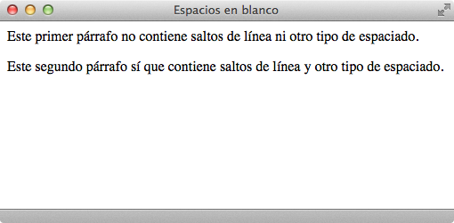
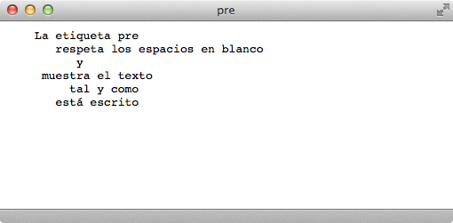
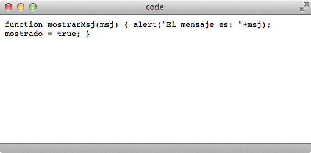

# Espacios en blanco y nuevas líneas

## Espacios en blanco

El lenguaje **HTML** considera **espacio en blanco** a: los espacios en blanco, los tabuladores, los retornos de carro y el carácter de nueva línea. HTML ignora todos los espacios en blanco sobrantes, es decir, todos los espacios en blanco que no son el espacio en blanco que separa las palabras.

Un ejemplo de este comportamiento sería:

```html
<html>
    <head>
        <title>Espacios en blanco</title>
    </head>
    <body>
        <p>Este primer párrafo no contiene saltos de línea ni otro tipo de espaciado.</p>
        <p>Este segundo párrafo sí que contiene saltos
        de
        línea
        y   otro   tipo   de   espaciado.</p>
    </body>
</html>```


Que un navegador visualizaría de esta manera:



Sin embargo, existen alternativas para incluir **espacios en blanco adicionales**. Esto se consigue sustituyendo cada nuevo espacio en blanco por el texto `&nbsp;`.

Cada texto `&nbsp;` equivale a un sólo espacio en blanco, por lo que se deben escribir tantos `&nbsp;` seguidos como espacios en blanco se quieran conseguir.

Si quisiéramos visualizar el texto del ejemplo anterior con todos los espacios adicionales, debería escribirse de esta manera:

```html
<html>
    <head>
        <title>Espacios en blanco</title>
    </head>
    <body>
        <p>Este primer párrafo no contiene saltos de línea ni otro tipo de espaciado.</p>
        <p>Este segundo párrafo sí que contiene saltos <br/>
        de <br/>
        línea <br/>
        y &nbsp;&nbsp; otro &nbsp; tipo &nbsp; de &nbsp; espaciado.</p>
    </body>
</html>```


Que un navegador visualizaría de esta manera:


Este ejemplo de **código HTML** incluye la etiqueta `<br/>`, que se explica a continuación.

## Nuevas líneas

Para forzar una nueva línea, o lo que es lo mismo, lo equivalente a presionar la tecla *Enter* o *Intro* escribiendo un texto, se utiliza el *tag* `<br>`. Se trata de una **etiqueta vacía**, es decir, no encierra ningún texto.

| Etiqueta              | `<br>`    |
| --------------------: | :------------- |
| **Atributos comunes** | básicos |
| **Atributos propios** | - |
| **Tipo de elemento**  | En línea y etiqueta vacía |
| **Descripción**       | Fuerza al navegador a insertar una nueva línea |

Existen varias formas de expresar esta etiqueta. Si bien se puede abrir y cerrar de forma consecutiva (`<br></br>`), la forma de uso más común es abriendo y cerrando un único *tag* de esta forma: `<br/>`o `<br />`.

## Texto preformateado

Existe una manera de mostrar el **texto tal y como está escrito**, respetando los espacios en blanco y las nuevas líneas. Se utiliza, por ejemplo, cuando una página debe mostrar directamente el texto generado por alguna aplicación.

| Etiqueta              | `<pre>`    |
| --------------------: | :------------- |
| **Atributos comunes** | básicos, internacionalización, eventos |
| **Atributos propios** | - |
| **Tipo de elemento**  | En bloque |
| **Descripción**       | Muestra el texto que contiene tal y como está escrito |

Los elementos `<pre>` son algo especiales, ya que los navegadores les aplican algunas reglas:

- Mantienen todos los espacios en blanco (tabuladores, espacios y nuevas líneas)
- Muestra el texto con un tipo de letra de ancho fijo (todas las letras de la misma anchura)
- No se ajusta la longitud de las líneas (las líneas largas producen un *scroll* horizontal), lo que provoca que la anchura de la página sea superior a la anchura de la ventana del navegador.

Un ejemplo de **código HTML** con la etiqueta `<pre>` sería:

```html
<html>
    <head>
        <title>Etiqueta pre</title>
    </head>
    <body>
        <pre>
        La etiqueta pre
           respeta los espacios en blanco
              y
         muestra el texto
             tal y como
           está escrito
        </p>
        </pre>
    </body>
</html>```


Y un navegador lo visualizaría de esta manera:



También existe la etiqueta `<code>` que se utiliza para mostrar código fuente de cualquier lenguaje de programación.

| Etiqueta              | `<code>`    |
| --------------------: | :------------- |
| **Atributos comunes** | básicos, internacionalización, eventos |
| **Atributos propios** | - |
| **Tipo de elemento**  | En bloque |
| **Descripción**       | Delimita el texto considerado un fragmento de código fuente |

Las reglas que los navegadores aplican a las etiquetas `<code>` son:

- Muestra el texto con un tipo de letra de ancho fijo (todas las letras de la misma anchura)

Sin embargo, no respeta los espacios en blanco ni las líneas, por lo que, en ese sentido, su comportamiento es similar a la etiqueta `<p>`.

Un ejemplo de **código HTML** con la etiqueta `<code>` sería:

```html
<html>
    <head>
        <title>code</title>
    </head>
    <body>
        <code>
            function mostrarMsj(msj)
            {
                alert("El mensaje es: "+msj);
                mostrado = true;
            }
        </code>
    </body>
</html>```




<div class="exercise">
  <p class="title">Ejercicio 4</p>
</div>

[Ver enunciado](#ej04)

<div class="exercise">
  <p class="title">Ejercicio 5</p>
</div>

[Ver enunciado](#ej05)
