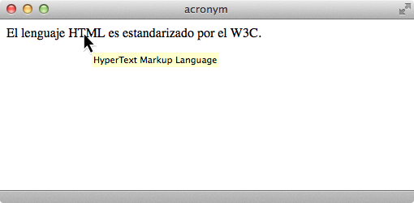

# Marcado avanzado de un texto

La etiqueta `<abbr>` marca las abreviaturas de un texto y la etiqueta `<acronym>` se emplea para marcar las siglas o acrónimos del texto. En ambos casos, el atributo `title` se puede utilizar para incluir el significado completo de la abreviatura o sigla. La mayoría de navegadores muestran por defecto un borde inferior punteado para estos elementos.

| Etiqueta              | `<abbr>`    |
| --------------------: | :------------- |
| **Atributos comunes** | básicos, internacionalización, eventos |
| **Atributos propios** | `title="texto"` Indica el significado completo de la abreviatura |
| **Tipo de elemento**  | En línea |
| **Descripción**       | Se emplea para marcar las abreviaturas del texto y proporcionar el significado de esas abreviaturas |

| Etiqueta              | `<acronym>`    |
| --------------------: | :------------- |
| **Atributos comunes** | básicos, internacionalización, eventos |
| **Atributos propios** | `title="texto"` Indica el significado completo del acrónimo o sigla |
| **Tipo de elemento**  | En línea |
| **Descripción**       | Se emplea para marcar las siglas o acrónimos del texto y proporcionar el significado de esas siglas |

Un ejemplo de **código HTML** con la etiqueta `<acronym>` sería:

```html
<html>
    <head>
        <title>Etiqueta acronym</title>
    </head>
    <body>
        <p>El lenguaje <acronym title="HyperText Markup Language">
        HTML</acronym> es estandarizado por el <acronym title="World
        Wide Web Consortium">W3C</acronym>.</p>
    </body>
</html>```


Y un navegador lo visualizaría de esta manera:



La etiqueta `<dfn>` proporciona al usuario la definición de todas las palabras para las que se considere apropiado, y la etiqueta `<cite>` se utiliza para marcar un texto como una citación:

| Etiqueta              | `<dfn>`    |
| --------------------: | :------------- |
| **Atributos comunes** | básicos, internacionalización, eventos |
| **Atributos propios** | `title="texto"` Indica el significado completo del término |
| **Tipo de elemento**  | En línea |
| **Descripción**       | Se emplea para marcar las definiciones de ciertos términos y proporcionar el significado de esos términos |

Un ejemplo de **código HTML** con la etiqueta `<dfn>` sería:

```html
<p>Con estos síntomas, podría tratarse de un caso de <dfn title="Imagen o sensación subjetiva, propia de un sentido, determinada por otra sensación que afecta a un sentido diferente">sinestesia</dfn></p>```


| Etiqueta              | `<cite>`    |
| --------------------: | :------------- |
| **Atributos comunes** | básicos, internacionalización, eventos |
| **Atributos propios** | - |
| **Tipo de elemento**  | En línea |
| **Descripción**       | Se emplea para marcar una cita o una referencia a otras fuentes |

La diferencia entre `<cite>` y `<blockquote>` está en que el elemento `<cite>` marca el autor de la cita (persona, documento, etc.) y `<blockquote>` marca el contenido de la propia cita.

Un ejemplo de **código HTML** con ambas etiquetas sería:

```html
Como dijo <cite>Mahatma Gandhi</cite>:
<blockquote>Vive como si fueras a morir mañana y aprende como si fueras a vivir para siempre.</blockquote>
```
